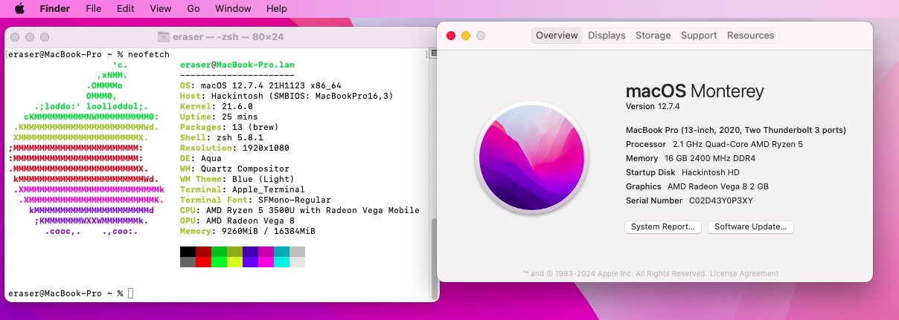

# ThinkPad-T495-Hackintosh
 Hackintosh for ThinkPad T495.
 

## Prerequisites
| **My Hardware**      |                      |
|----------------------|----------------------|
| Laptop Model         | ThinkPad T495        |
| CPU                  | AMD Ryzen 5 3500U 4c8t |
| Graphics             | Integrated AMD Radeon Vega 8(set to 2GB) |
| Wi-Fi Card           | AX200                |
| SSD                  | SN580 512GB          |
| Audio                | Conexant CX8070      |
| macOS   | 12.0-14.7 |

| **Feature**          | **Status**           |
|----------------------|----------------------|
| Keyboard              | Working              |
| Trackpad              | Working              |
| USB Ports             | Working              |
| GPU Acceleration      | Working              |
| Wi-Fi                | Working              |
| Bluetooth            | Working              |
| Audio                | Partially Working(see below)             |
| AirPlay              | Working              |
| Sidecar              | Not Working             |
| HDMI                 | Untested             |
| Type-C Display       | Untested             |
| Fingerprint          | Won't Work at All    |
| AirDrop              | Won't Work at All    |
| iPhone Mirroring     | Won't Work at All    |
| DRM-related stuff    | Won't Work at All    |

## Installation Steps
1. Clone or download this repository.
2. Place the `EFI` folder into your bootable USB drive for macOS installation.
3. Boot from the USB drive and install macOS as per standard procedures.

## BIOS Settings
- Disable: TPM, Secure Boot, Memory Protection
- Enable: UEFI Only, AMD Virtualization, Hyper Thread

## Further Improvements
- ~~1. Audio support from AppleALC~~
- ~~2. Power Management~~
- 3. Readme in Chinese
